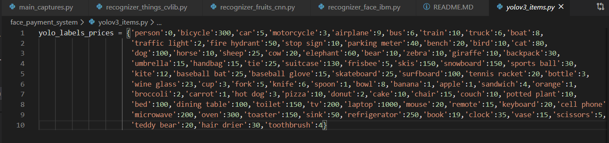
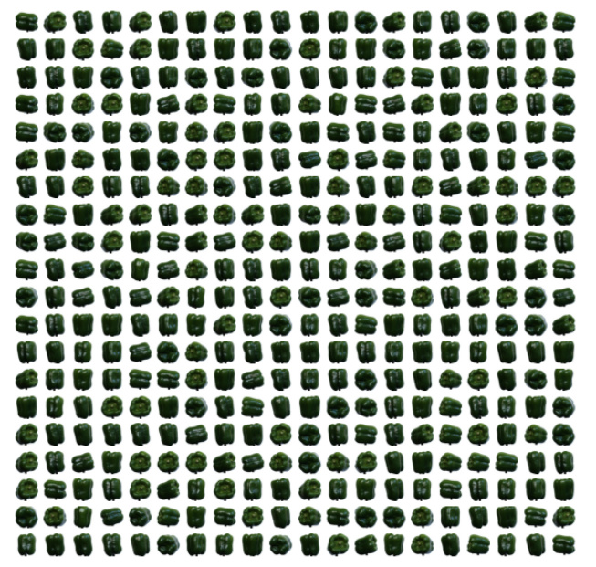
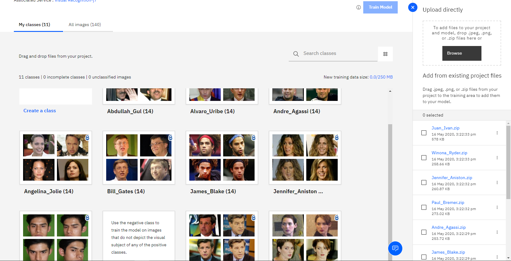
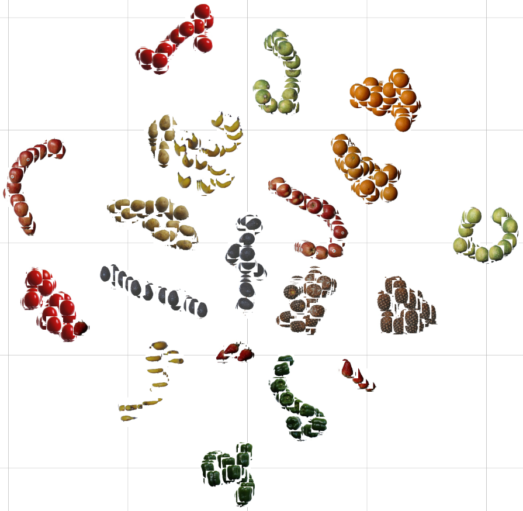

# Project description:

This program tries to facilitate the purchase and payment process in supermarkets and stores, ideally the buyer should only take the product he wants from the shelves or parking spaces, and gradually avoid the traditional payment process, which is replaced by facial recognition of the buyer, the payment is automatically executed when the buyer leaves the store, after which he will receive an email with the purchase ticket of the things that were taken by him. 

--------------------------------------------------------------------------------------------------------------------------------------------------------------------------------------------------------------------------------------------------------------------------------------------

### Requirements and installations

    1.-OpenCV: "pip install opencv-python"
    2.-cvlib: "pip install cvlib"
    3.-Keras: "https://pypi.org/project/Keras/"
    4.-email: "pip install email-to"
    5.-ibm_watson: "pip install --upgrade "watson-developer-cloud>=2.4.1""
    6.-json: "json" or "jsonlib"
    7.-tensorflow: 'pip install tensorflow'

Files from OpenCV located in the same working folder: "haarcascade_frontalface_alt.xml" and "haarcascade_frontalface_default.xml"

images datasets: https://lionbridge.ai/datasets/12-free-retail-image-datasets-for-computer-vision/

# Program architecture

### Step 1 define tools:

Fisrts of all we should know what tools are we going to use and wich inputs should have those tools.
It´s not a easy proces, there a lot of tools but part of succes is to select the right tool.

In this proeject for face recognition is used VisualRecognitionV3, a library from IBM wattson.
For things recognition in phictures is used cvlib, it uses YOLOv3 model trained on COCO dataset capable of detecting 80 common objects in context.

The last tool is a fruit recognizer trained with a convolutional neural network in keras.

Image captures are used because low computer resources but also streeming video can be used with powerfull equipments.
My computer resources are a processor (intel i5 7th gen), graphic card (nvidia 1050 gtx), and 8gb ram.

### Step 2 get data:

IBM watson model: 14 people with 14 photos (250px,250px,3RGB) from each one.

cvlib: cvlib identifies by itself 80 item types, almost all labels allowed are named in the file 'yolov3_items.py'.

keras CNN: Fruists images (100px,100px,3RGB).

(Example of images contained in each folder, this if from pepper´s folder.)

### Step 3 recognizers: 

Recognizer_face_IBM: IBM watson allows you to train your own image recognizer model by only giving folders with images, each folder should be called as the category name, because thats the name that watson will return, not the name of each image.

(Folders used to train the model)

Recognizer_things_cvlib: cvlib identifies by itselfs images giving a label, to each image box where something is identified, in an image, video, or streaming cam.

Recognizer fruits: From Keras CNN image clasifier the more images you have, the best training receives the network:
    
    1.- The last model is trained with around 7000 images from 15 diffent fruits
    2.- Looping over fruits image folders to get fruits names and pixels in arrays shape
    3.- Giving a categorical label to each array name
    4.- Same steps for the test data set, but is not necesary to have one, train data set can be divided.
    5.- Building the convolutional neural network, by changing parameters like filters, or epochs acuracy plot behaviour is afected.
    6.- Trainig the network it can takes so long dependig on the computer resources, an option could be use google colab can be used.
    7.- Making a tests with images and different models.

(Some fruits to train the CNN model)

### Step 4 testing:

All sub programs should be tested before join all in a main.

Sub programs like:

    1.- recognizer_face_IBM: Should send a request and an'apy key' with somebody´s photo to return the name.
    2.- recognizer_things_cvlib: Should return us labels and prices of the objects detected.
    3.- recognizer fruits: Should recognize the fruits pictures with the model we have trained before.
    4.- send_mail: should send mails and attachments, for this step is important to allow aplication acces to google account.
    5.- main_captures: should capture images and send it to the different folders where recognizers will take those images to clasiffi it.  

### Step 5 join toghether all subprograms:

After programs are properly tested all should be rady to join, executing only 'main captures.py' program it should do:

Deploy the camera.
Take pictures and send it to the respectively recognizer folder.
Return someone's information, and items names.
Finally send the bill.

### Step 6 ready to production:

At the end synchronization is a little hard because a bad internet connection can cause a rejection in some request, then all the program would crash.

# How to use it?:

Execute the program ...

When camera is deployed we can press:
'Space' to capture someones face.
's' to capture things
'q' to capture some of the fruits available in the model
'esc' to close the camera

then in the console will be printed buyer data and the products he has taken

finally 'mail ok' will be printed

... and its everithing, open your mail and check your ticket.

(Demo)

